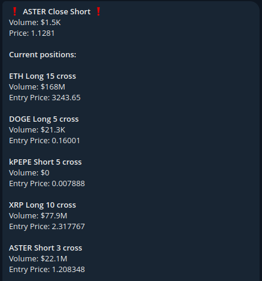

# Hyperliquid Wallets Monitor 🐳

### Should be considered as MVP. Any contribution is appreciated. ⭐️

The bot monitors new trades of specified Hyperliquid accounts and sends alerts when detected.



### Setup instructions:

1. **Create a Telegram Bot**  
   Use [@BotFather](https://telegram.me/botfather) to create a new bot. Add the received token to the `.env` file.

2. **Configure Access**  
   Add Telegram IDs of authorized users to the `.env` file. It can be your friends or community. These users can manage monitored wallets and interact with the bot. Other users will be ignored.

3. **Initialize wallets.txt**  
   Create an empty `wallets.txt` file to store Hyperliquid addresses for monitoring. The bot reads this file on startup and updates it before shutdown.

4. **Manage Wallets**  
   Authorized users can:  
   - Add wallets: `/addwallet 0x...`  
   - Remove wallets: `/removewallet 0x...`  
   - Check status: Send any message to get last update time and monitored wallets list

### Environment Configuration (.env)
```bash
BOT_TOKEN=    # Token from BotFather
CHAT_IDS=     # Comma-separated list of authorized Telegram IDs
ADMIN_ID=     # Admin Telegram ID
MODE=         # TEST (local testing) or PROD (production)
```

### Deployment
Run the bot as a service using ```systemctl```