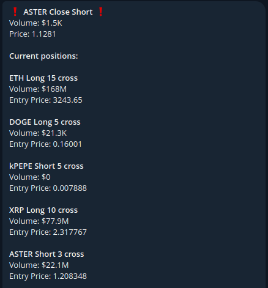

# Hyperliquid Wallets Monitor 🐳

### Minimum Viable Product. Any contribution is appreciated. ⭐️

The bot monitors new trades of specified Hyperliquid accounts and sends alerts when detected.



### Message Structure
When positions of one of the specified wallets change, the bot queries the most recent fill (for example, HYPE Open Long). If there are no such fills for this account in the last hour, a new message will be sent. If the account has such fills recently, the last message for this account will be edited.

The message contains:
- Last discovered fill
- Current account positions with their volume updates from the last hour
- Link to the Hyperliquid page

### Setup instructions:

1. **Create a Telegram Bot**  
   Use [@BotFather](https://telegram.me/botfather) to create a new bot. Add the received token to the `.env` file.

2. **Configure Access**  
   Add Telegram IDs of authorized users to the `.env` file. These can be your friends or community members. These users can manage monitored wallets and interact with the bot. Other users will be ignored.

3. **Initialize wallets.txt**  
   Create an empty `wallets.txt` file in the root folder of the project to store Hyperliquid addresses for monitoring. The bot reads this file on startup and updates it before shutdown.

4. **Manage Wallets**  
   Authorized users can:  
   - Add wallets: `/addwallet 0x...`  
   - Remove wallets: `/removewallet 0x...`  
   - Set a tag to a wallet for identification: `/settag 0x... some_tag`
   - Check status: Send any message to get the last update time and monitored wallets list

### Environment Configuration (.env)
```bash
BOT_TOKEN=    # Token from BotFather
CHAT_IDS=     # Comma-separated list of authorized Telegram IDs
ADMIN_ID=     # Admin Telegram ID
MODE=         # TEST (local testing) or PROD (production)
```

### Deployment
Run the bot as a service using `systemctl`